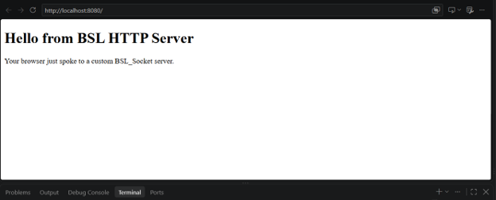
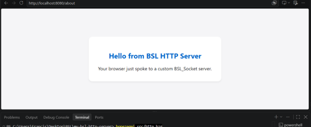
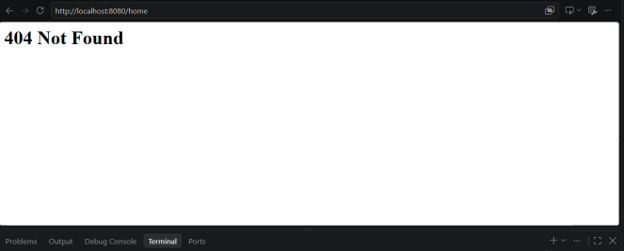
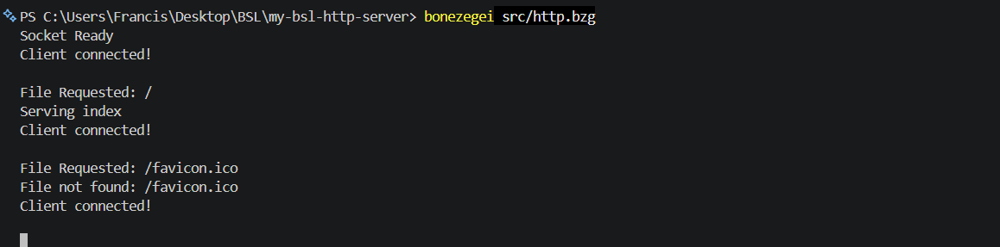

# BSL Custom HTTP Server

## 1. Project Description
This project is a custom, lightweight HTTP web server built entirely using the Bonezegei Scripting Language (BSL). Its primary purpose is to demonstrate low-level network programming by utilizing raw TCP sockets (`lib/socket.bzg`) to listen for incoming connections, parse raw HTTP requests using regular expressions, and serve HTML responses dynamically. It features manual routing for specific endpoints and graceful error handling for invalid or unknown requests.

## 2. Installation & Setup Guide
Follow these steps to get the server up and running on your local machine:

1. **Install BSL:** Ensure you have the Bonezegei Scripting Language (BSL) interpreter installed on your system.
2. **Clone the Repository:** Clone this project repository to your local machine and navigate into the root project directory in your terminal.
3. **Verify Dependencies:** Ensure the socket library (`lib/socket.bzg`) is present in the `lib/` directory so the server script can include it.
4. **Run the Server:** Open your terminal and execute the server script using the CLI:
   ```bash
   bonezegei "file location" http.bzg
   ```
   *(Note: The terminal will display "Socket Ready" and wait for incoming connections on port 8080.)*

## 3. Usage Instructions
Once the server is actively running in your terminal, open any web browser and use the following URLs to test the endpoints:

*   **Root Route:** Navigate to `http://localhost:8080/` to view the main welcome page.
*   **About Route:** Navigate to `http://localhost:8080/about` to view the styled About page.
*   **Unknown Routes (404 Test):** Navigate to any undefined path (e.g., `http://localhost:8080/home`, `http://localhost:8080/user`, or `http://localhost:8080/anything`) to verify that the server properly returns the custom 404 Not Found error page.

*Keep your terminal visible while browsing; it will log the connection events and the specific paths requested by your browser.*

## 4. Screenshots Section

### Root Route (`/`)


### About Route (`/about`)


### 404 Error Page


### Terminal Running Server
